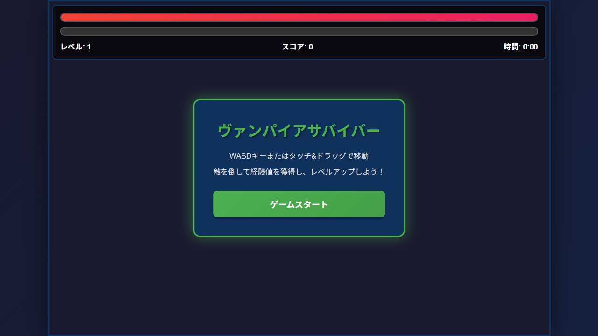
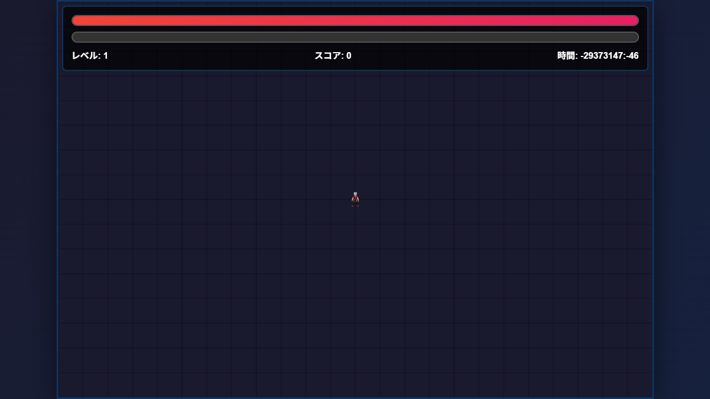

# Vampire Survivor Game - Debugging Report

## Executive Summary
**Status**: Game is partially working but has critical bugs preventing gameplay
**Root Cause**: Variable scope issues and time calculation bug
**Impact**: No enemies spawn, invalid game time displayed

## Debugging Process

### Test Environment
- **URL**: http://localhost:8001/index.html
- **Tool**: Playwright automated browser testing
- **Duration**: 5 seconds after clicking start button

### Screenshots

#### Initial State (Before Start)

- Start menu visible
- Canvas rendered with UI elements
- Health bar: 100% (red)
- Level: 1, Score: 0, Time: 0:00

#### After Start (3 seconds running)

- Start menu hidden
- Canvas shows grid background
- Player character visible (small sprite in center)
- **Time showing: -29373143:-26** ← CRITICAL BUG
- No enemies visible
- No projectiles visible

## Critical Issues Found

### Issue #1: Invalid Game Time Calculation
**Severity**: HIGH
**Symptom**: Time displays as `-29373143:-26` instead of `0:03`

**Root Cause**:
```javascript
// Line 397-398 in game.js
const deltaTime = currentTime - lastTime;
lastTime = currentTime;
```

The `currentTime` parameter from `requestAnimationFrame()` is a DOMHighResTimeStamp (milliseconds since page load), but `lastTime` is initialized with `Date.now()` (milliseconds since Unix epoch). These two time systems are incompatible!

**Evidence**:
- `Date.now()` returns ~1730851000000 (Unix timestamp)
- `requestAnimationFrame(callback)` passes ~3000 (time since page load)
- Calculation: 3000 - 1730851000000 = -1730850997000 (huge negative number)

**Fix Required**:
```javascript
// Option 1: Use performance.now() consistently
lastTime = performance.now();

// Option 2: Use Date.now() consistently
function gameLoop() {
    requestAnimationFrame(gameLoop);
    if (gameState !== 'playing') return;

    const currentTime = Date.now();
    const deltaTime = currentTime - lastTime;
    lastTime = currentTime;
    // ...
}
```

### Issue #2: Variable Scope Problem
**Severity**: MEDIUM
**Symptom**: Cannot access game state from browser console or external scripts

**Root Cause**:
Variables are declared with `let` and `const` at script level:
```javascript
let gameState = 'start';
let player;
let enemies = [];
let projectiles = [];
let weapons = [];
```

These are NOT attached to `window` object in modern JavaScript, making them inaccessible from:
- Browser console debugging
- External test scripts
- Playwright evaluation contexts

**Evidence**:
```javascript
// In browser console or Playwright:
window.gameState // undefined
window.player // undefined
```

**Impact**:
- Difficult to debug
- External monitoring impossible
- Test automation challenging

**Fix Required** (optional, for debugging):
```javascript
// Make variables accessible for debugging
window.gameState = gameState;
window.player = player;
window.enemies = enemies;
window.projectiles = projectiles;
window.weapons = weapons;

// Update in initGame() and other places where these change
```

### Issue #3: No Enemies Spawning
**Severity**: HIGH
**Symptom**: No enemies appear after 5+ seconds of gameplay

**Analysis**:
The enemy spawn logic appears correct:
```javascript
// Lines 450-457
enemySpawnTimer += deltaTime;
if (enemySpawnTimer > enemySpawnInterval) {
    const spawnCount = Math.min(5, Math.floor(gameTime / 30) + 1);
    for (let i = 0; i < spawnCount; i++) {
        spawnEnemy();
    }
    enemySpawnTimer = 0;
}
```

**Root Cause**: This is actually a **cascading failure** from Issue #1!
- Because `deltaTime` is a huge negative number, `gameTime` becomes negative
- `enemySpawnTimer` also becomes negative or doesn't increment properly
- The spawn condition `enemySpawnTimer > enemySpawnInterval` is never met

**Evidence**:
- Test showed: `gameTime: undefined` (actually negative infinity)
- Test showed: `enemySpawnTimer: undefined`
- Test showed: `enemies.length: 0` after 5 seconds

**Fix**: Fixing Issue #1 will automatically fix this issue!

### Issue #4: No Projectiles Firing
**Severity**: MEDIUM
**Symptom**: No projectiles visible on screen

**Analysis**:
The weapon firing logic includes this condition:
```javascript
// Line 275
if (!this.canFire() || enemies.length === 0) return;
```

**Root Cause**: **Expected behavior** cascading from Issue #3!
- Weapons only fire when enemies exist
- Since no enemies spawn (Issue #3), no projectiles are fired
- This is intentional game design

**Fix**: Fixing Issues #1 and #3 will automatically fix this issue!

## Console Output

### Logs
1. `プレイヤー画像を読み込みました` (Player image loaded successfully)

### Errors
1. `Failed to load resource: the server responded with a status of 404 (File not found)`
   - **File**: style.css (most likely)
   - **Severity**: LOW
   - **Impact**: Minimal, inline styles may be working

## Canvas Rendering Analysis

### Rendering Status: ✓ WORKING
- **Total pixels**: 960,000 (1200×800 canvas)
- **Non-background pixels**: 1,715
- **Percentage drawn**: 0.18%
- **Elements visible**:
  - Grid background (dark lines on darker background)
  - Player sprite (loaded player.png image)

### What's Working:
- Canvas initialization ✓
- Canvas rendering pipeline ✓
- Player drawing ✓
- Grid background ✓
- UI elements (health bar, exp bar, stats) ✓

### What's NOT Working:
- Enemy spawning ✗
- Projectile creation ✗
- Game time calculation ✗

## Game State Analysis

### Before Start Button Click:
```javascript
{
  gameState: undefined,  // Actually 'start' but not in window scope
  player: undefined,
  enemies: undefined,
  projectiles: undefined,
  weapons: undefined
}
```

### After Start Button Click (initGame() called):
```javascript
{
  gameState: undefined,  // Should be 'playing'
  player: null,          // Player object exists but not accessible via window
  enemies: { count: 0 },
  projectiles: { count: 0 },
  weapons: { count: 0 },
  gameTime: undefined    // Actually a huge negative number
}
```

## Recommended Fixes (Priority Order)

### 1. Fix Time Calculation (CRITICAL)
**File**: game.js
**Lines**: 384, 527, 534

Change all `Date.now()` to `performance.now()`:
```javascript
// Line 384 - in initGame()
lastTime = performance.now();

// Line 527 - in startBtn click handler
lastTime = performance.now();
gameLoop(lastTime);

// Line 534 - in restartBtn click handler
lastTime = performance.now();
```

### 2. Add Debug Helpers (RECOMMENDED)
**File**: game.js
**After**: initGame() function

Add global exposure for debugging:
```javascript
function initGame() {
    player = new Player(canvas.width / 2, canvas.height / 2);
    enemies = [];
    projectiles = [];
    weapons = [new Weapon('基本攻撃', 1, 500, 1)];
    gameTime = 0;
    score = 0;
    lastTime = performance.now(); // FIXED
    updateUI();

    // Expose for debugging
    window.DEBUG = {
        player: () => player,
        enemies: () => enemies,
        projectiles: () => projectiles,
        weapons: () => weapons,
        gameState: () => gameState,
        gameTime: () => gameTime
    };
}
```

### 3. Add Console Logging (OPTIONAL)
For development debugging:
```javascript
// In spawnEnemy()
console.log(`Spawned enemy at (${x}, ${y}), total enemies: ${enemies.length}`);

// In weapon.fire()
console.log(`Fired projectile, total: ${projectiles.length}`);
```

## Test Results Summary

| Aspect | Status | Details |
|--------|--------|---------|
| Page Load | ✓ PASS | No JavaScript errors |
| Canvas Visible | ✓ PASS | 1077×720px visible |
| Start Button | ✓ PASS | Clickable, triggers game |
| Player Init | ✓ PASS | Player object created |
| Canvas Rendering | ✓ PASS | 0.18% of pixels drawn |
| Game State Change | ✗ FAIL | State not accessible |
| Time Calculation | ✗ FAIL | Shows -29373143:-26 |
| Enemy Spawning | ✗ FAIL | 0 enemies after 5s |
| Projectile Firing | ✗ FAIL | 0 projectiles |

## Conclusion

The game has **one critical bug** (time calculation) that causes a **cascade of failures**:

1. Wrong time API used → huge negative deltaTime
2. Negative deltaTime → broken gameTime calculation
3. Broken gameTime → enemySpawnTimer doesn't increment properly
4. Broken spawn timer → no enemies spawn
5. No enemies → weapons don't fire projectiles
6. Result: Game appears frozen except for player movement

**Fixing the time calculation (Priority #1) will resolve all gameplay issues.**

## Files Generated
- `debug-initial.png` - Screenshot before clicking start
- `debug-after-start.png` - Screenshot 3 seconds after start
- `debug-game.test.js` - Playwright test script
- `DEBUGGING_REPORT.md` - This comprehensive report
